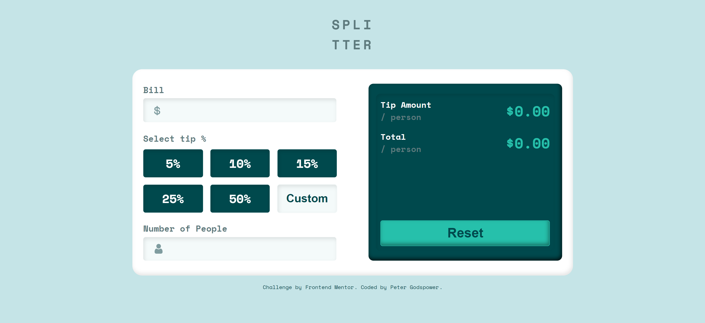

# Frontend Mentor | Tip Calculator App

This repository contains my solution for the "Tip Calculator App" challenge on Frontend Mentor. The project involves creating a user-friendly web application that helps users calculate tip amounts based on their bill and number of people.

## Table of Contents

- [Overview](#overview)
  - [Screenshot](#screenshot)
  - [Links](#links)
- [My Process](#my-process)
  - [Built With](#built-with)
  - [What I Learned](#what-i-learned)
  - [Continued Development](#continued-development)
  - [Useful Resources](#useful-resources)
- [Author](#author)
- [Acknowledgments](#acknowledgments)

## Overview

### Screenshot

### Links

- Solution URL: [Frontend Mentor Solution](https://www.frontendmentor.io/solutions/your-solution-url)
- Live Site URL: [Live Demo](https://your-github-username.github.io/your-repo-name)

## My Process

This project focuses on building an intuitive tip calculator that provides quick and accurate calculations for tip amounts and total costs based on user input. The design is clean and responsive, ensuring a seamless experience across devices.

### Built With

- **Semantic HTML5 Markup:** Utilized semantic elements for improved accessibility and SEO.
- **CSS:** Used custom properties for consistent styling, Flexbox for layout, and responsive design techniques.
- **JavaScript:** Implemented dynamic calculations and interactivity to enhance user engagement.

### Features

- **Bill Input:** Users can enter the total bill amount.
- **Tip Percentage Selection:** Users can choose a predefined tip percentage or enter a custom percentage.
- **Number of People Input:** Users can specify the number of people sharing the bill.
- **Dynamic Calculations:** Automatically calculates the tip amount and total per person as inputs change.
- **Reset Functionality:** Allows users to clear all inputs easily.

### JavaScript Functionality

The project includes a single JavaScript file that handles core functionality. Key components include:

- **Input Handling:** Listens for changes in the bill, tip percentage, and number of people.
- **Dynamic Calculations:** Updates the displayed tip amount and total cost in real-time based on user inputs.
- **Error Handling:** Displays user-friendly messages when inputs are invalid (e.g., no bill amount entered).

### What I Learned

Through this project, I enhanced my skills in:

- **Dynamic Calculations:** Understanding how to perform calculations based on user input.
- **Event Handling:** Effectively listening to and managing user events for a responsive UI.
- **Responsive Design:** Creating a layout that adapts to various screen sizes using CSS Flexbox.
- **Accessibility:** Ensuring all interactive elements are accessible to all users.

### Continued Development

Future updates may include:

- **Additional Features:** Implementing saving options for frequent users.
- **Styling Enhancements:** Adding more advanced styling and animations to improve the user experience.
- **Mobile Optimization:** Further optimizing the layout for various mobile devices.

### Useful Resources

- [MDN Web Docs](https://developer.mozilla.org/en-US/) - Comprehensive documentation for web technologies.
- [CSS-Tricks](https://css-tricks.com/) - Articles and tutorials on modern CSS techniques.
- [JavaScript.info](https://javascript.info/) - In-depth JavaScript tutorials and guides.
- [Frontend Mentor](https://www.frontendmentor.io/) - Platform for frontend challenges and community feedback.

## Author

- **Frontend Mentor:** [@YourUsername](https://www.frontendmentor.io/profile/@YourUsername)
- **GitHub:** [@YourUsername](https://github.com/YourUsername)

## Acknowledgments

A special thanks to Frontend Mentor for providing this challenging project and to the community for their valuable feedback and support throughout the development process.
